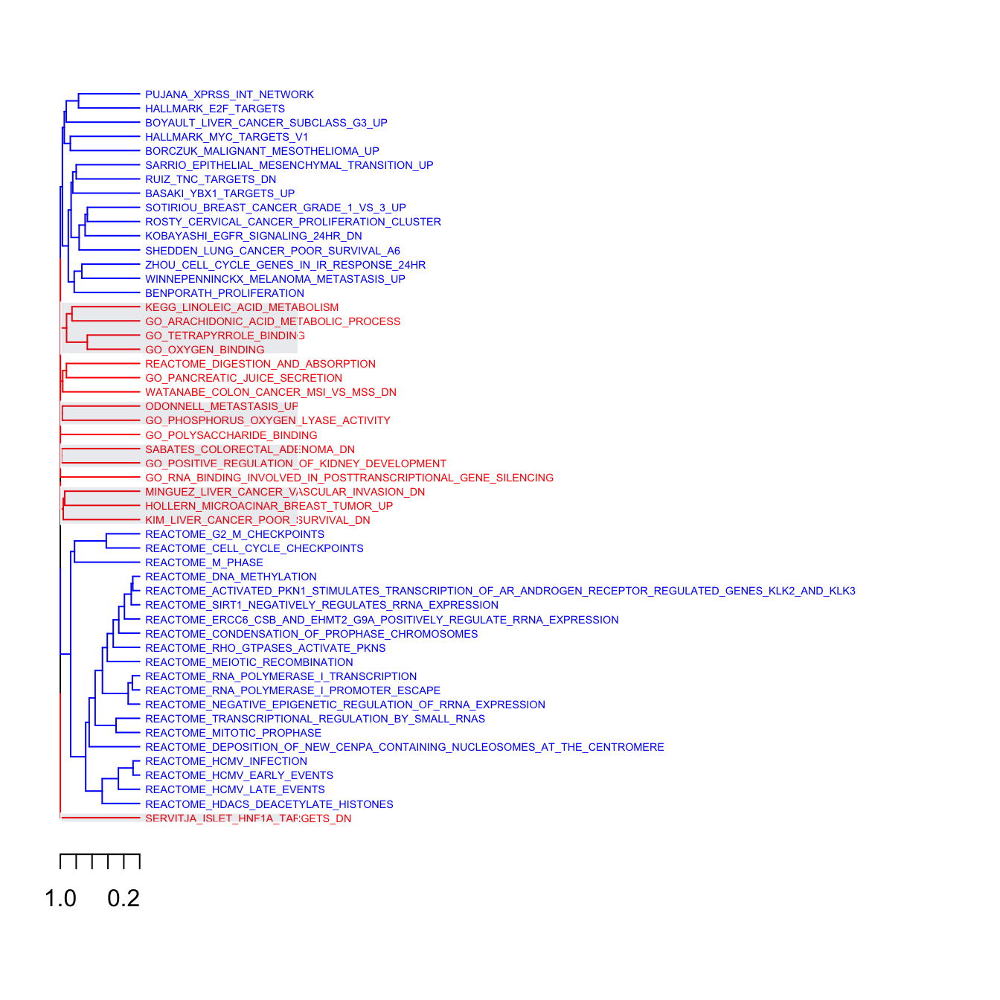
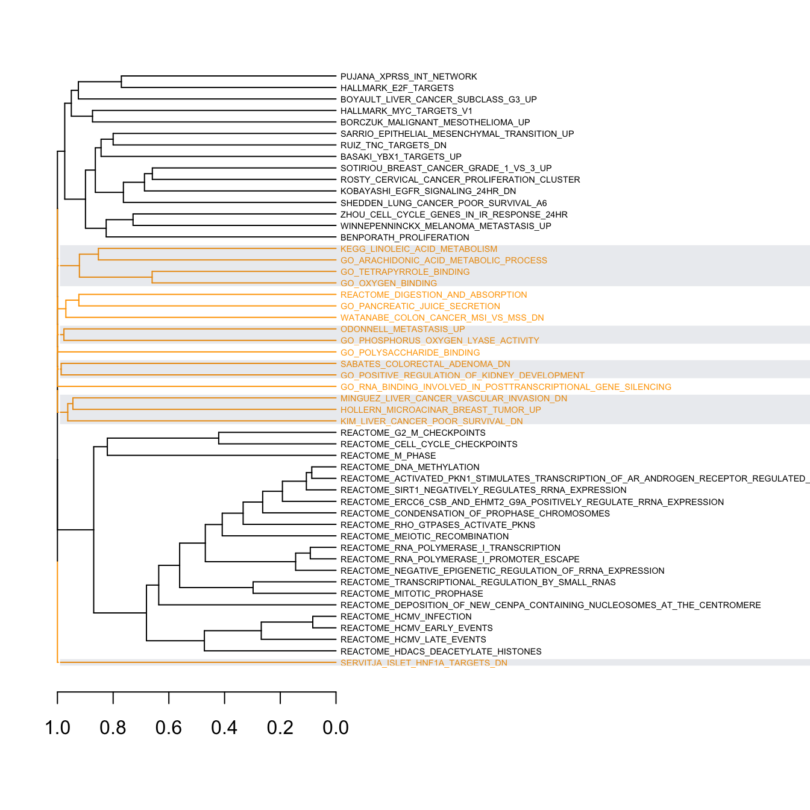
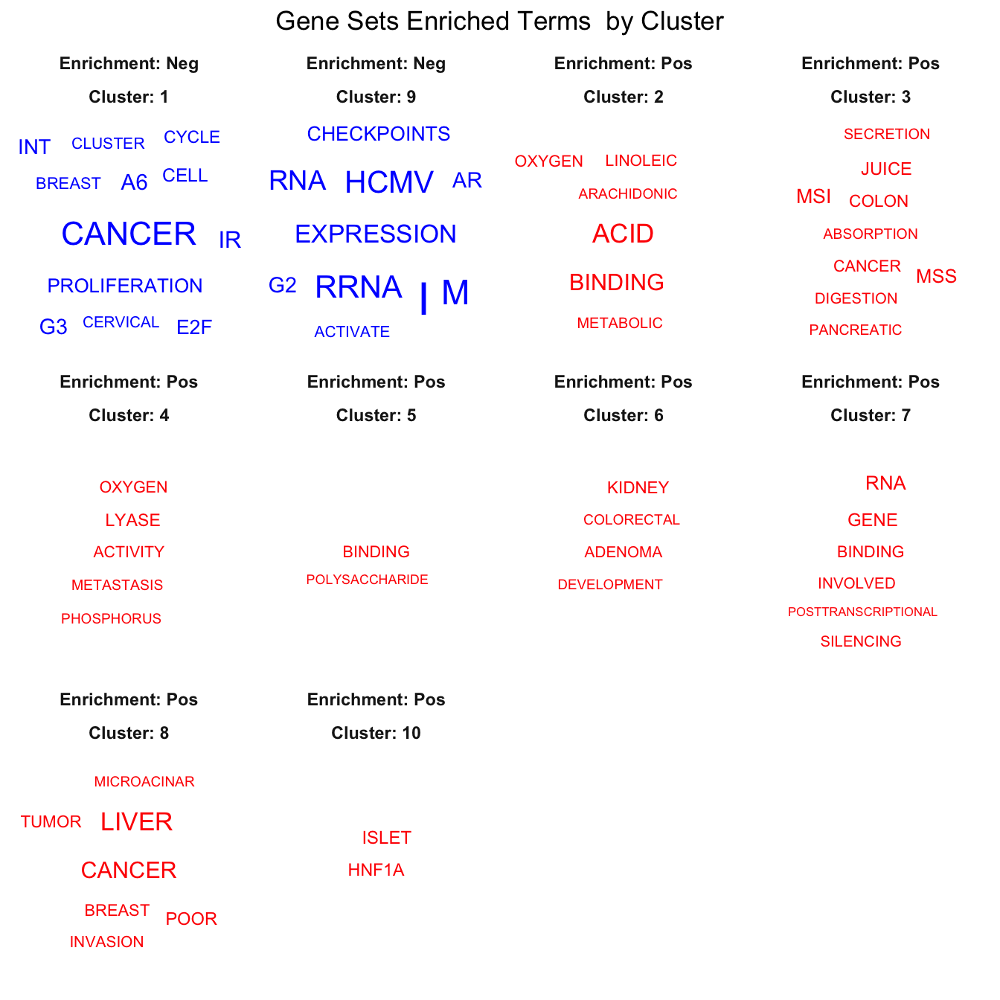
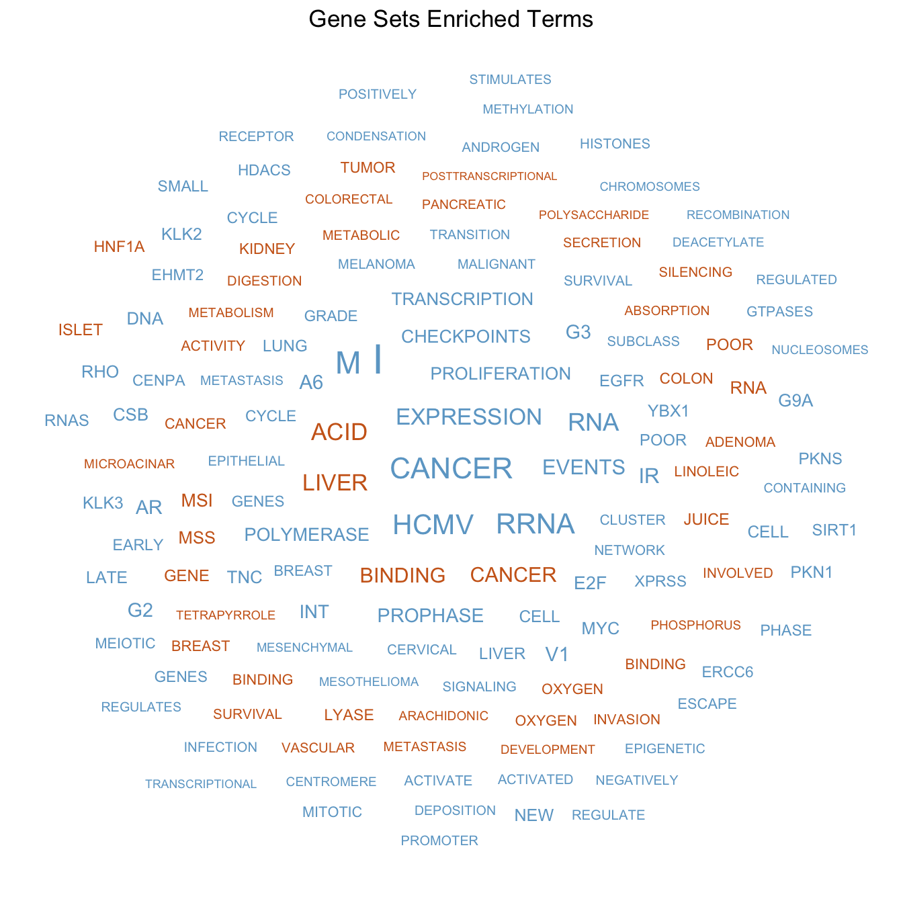
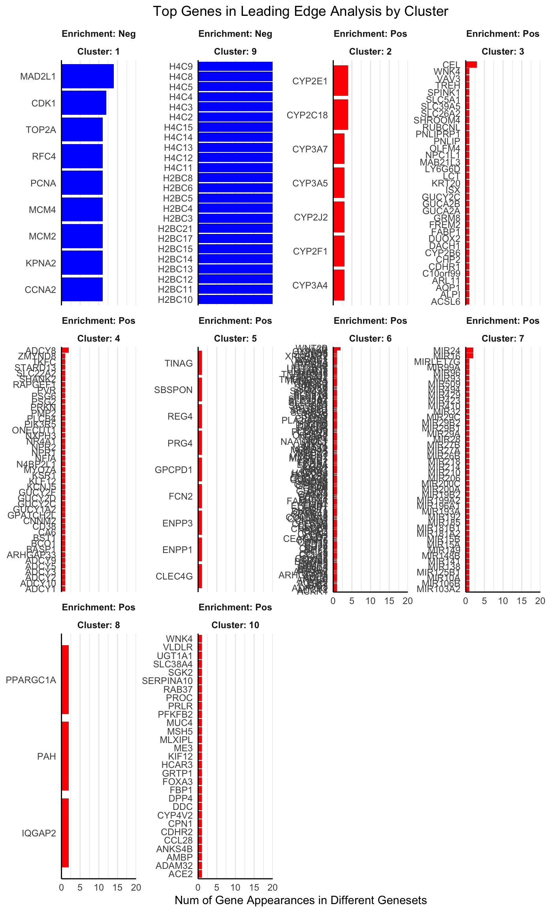

# Overview
Gene Set Enrichment Analysis 
([GSEA](https://www.gsea-msigdb.org/gsea/doc/GSEAUserGuideFrame.html)) 
is a very powerful and interesting computational method that allows an easy 
correlation between differential expressed genes and biological processes. 
Unfortunately, although it was designed to help researchers to interpret gene
expression data it can generate huge amounts of results whose biological 
meaning can be difficult to interpret. 

Many available tools rely on the hierarchically structured Gene Ontology (GO) 
classification to reduce reundandcy in the results. However, due to the 
popularity of GSEA many more gene set collections, such as those in the 
Molecular Signatures Database 
([MSigDB](https://www.gsea-msigdb.org/gsea/msigdb/index.jsp)), 
are emerging. Since these collections 
are not organized as those in GO, their usage for GSEA do not always give a 
straightforward answer or, in other words, getting all the meaninful information
can be challenging with the currently available tools. For these reasons, 
GSEAmining was born to be an easy tool to create reproducible reports to help 
researchers make biological sense of GSEA outputs.

Given the results of GSEA, GSEAmining clusters the different gene sets 
collections based on the presence of the same genes in the leadind edge 
(core) subset. Leading edge subsets are those genes that contribute most to the 
enrichment score of each collection of genes or gene sets. For this reason, 
gene sets that participate in similar biological processes should share genes 
in common and in turn cluster together. After that, GSEAmining is able to 
identify and represent for each cluster: 

- The most enriched terms in the names of gene sets (as word clouds)
- The most enriched genes in the leading edge subsets (as bar plots).

In each case, positive and negative enrichments are shown in different colors 
so it is easy to distinguish biological processes or genes that may be of 
interest in that particular study.

# Installation
You can install `GSEAmining` from Bioconductor:
```
if (!requireNamespace("BiocManager", quietly = TRUE))
    install.packages("BiocManager")

BiocManager::install("GSEAmining")
```

Or directly from GitHub:
```
install.packages("devtools") # If you have not installed "devtools" package
library(devtools)
devtools::install_github("oriolarques/GSEAmining")
```

# Input data format: gm_filter
By default GSEAmining is designed to accept the resuls of the GSEA function
from the [clusterProfiler](https://bioconductor.org/packages/release/bioc/html/clusterProfiler.html) 
package. For more information about this function click 
[here](https://yulab-smu.github.io/clusterProfiler-book/chapter7.html). However,
it is *not mandatory to use this package*.

In this example the data corresponds to GSEA analysis of differential expressed 
genes from treated versus control samples in 
[HGPalmer-PDX-P30 experiment](https://www.ebi.ac.uk/arrayexpress/experiments/E-MTAB-2446/).
Differential gene expression (tableTop) was obtained using the oligo and limma R 
packages.

- Generation of a geneList, which is a ranked list of all the genes, 
for GSEA using clusterProfiler.
```
# A geneList contains three features:
# 1.numeric vector: fold change or other type of numerical variable
# 2.named vector: every number has a name, the corresponding gene ID
# 3.sorted vector: number should be sorted in decreasing order
tableTop_p30 <- as.data.frame(tableTop_p30)
geneList = tableTop_p30[,2]
names(geneList) = as.character(tableTop_p30[,1])
```

- Gmt files containing the different gene sets that will be analysed by GSEA. They
can be downloaded from the
[MSigDB](https://www.gsea-msigdb.org/gsea/downloads.jsp)
```
library(clusterProfiler)
# Read the .gmt file from MSigDB
gmtC2<- read.gmt("gmt files/c2.all.v7.1.symbols.gmt")
gmtC5<- read.gmt('gmt files/c5.all.v7.1.symbols.gmt')
gmtHALL <- read.gmt('gmt files/h.all.v7.1.symbols.gmt')

# Merge all the gene sets
gmt_all <- rbind(gmtC2, gmtC5, gmtHALL)
```

- Perform the GSEA.
```
GSEA_p30<-GSEA(geneList, TERM2GENE = gmt_all, nPerm = 1000, pvalueCutoff = 0.5)

# Selection of gene sets with a specific thershold in terms of NES and p.adjust
genesets_sel <- GSEA_p30@result
```


Data should be in a data.frame with, **at least** three columns labelled as 
follows:

- **ID**: The name of the gene set.

- **NES**: Normalized Enrichment Score of the gene set.

- **core_enrichment**: Genes that appear in the leading edge subset of the gene
set.

```
# Structure of the data included in the package
data('genesets_sel', package = 'GSEAmining')
tibble::glimpse(genesets_sel)
```

**gm_filter: Filter the input data**

GSEA outputs normally presents tens or hundreds of genesets but many of them 
may not meet the thresholds for considering them significantly enriched. For 
that it is better to filter the data for a better visualization.

The `gm_filter()` function of GSEAmining allows this process to be very easy, 
especially if the format of your data meets the aforementioned criteria.

```
library(GSEAmining)
data("genesets_sel", package = 'GSEAmining')
gs.filt <- gm_filter(genesets_sel, 
                     p.adj = 0.05, 
                     neg_NES = 2.6, 
                     pos_NES = 2)
```

# Clustering
## gm_clust: Creation of a gm_clust object
Using the `gm_clust()` function, we can create an object that will contain the 
hierarchical clustering of the gene sets according to their genes in the 
core_enrichment column. This function accepts the data frame created with 
gm_filter. In the process, a distance matrix  is calculated using the 
*binary* method (from the `dist()` function in `stats`) and then a cluster with 
the *complete* method (from `hclust()` function in `stats`) is created.

```
# Create an object that will contain the cluster of gene sets.
gs.cl <- gm_clust(gs.filt)
```

## gm_dendplot: Plot the cluster
The `gm_dendplot()` function uses (i) the filtered data frame and (ii) the 
gm_clust object to plot the cluster dendrogram. It shows which gene sets are
positively or negatively enriched coloring them in red or blue respectively. 
Additionally by default the function will highlight every other cluster with a
rectangle to facilitate the differentiation of all the clusters.

```
gm_dendplot(gs.filt, 
            gs.cl)
```


It is possible to tune the height of the dendrogram, the colors for the 
enrichment and the use of rectangles (and their sizes) for highlighting 
clusters.

```
gm_dendplot(gs.filt, 
            gs.cl, 
            col_pos = 'orange', 
            col_neg = 'black', 
            rect = TRUE,
            dend_len = 20, 
            rect_len = 2)
```


# Evaluation of gene sets enriched terms by cluster
To start getting an idea of what kind of biological processes are represented
in each cluster we can use `gm_enrichterms()`. This function plots word clouds
for the most enriched terms in the names of the different gene sets in each 
cluster. Again it needs (i) the filtered data frame and (ii) the gm_clust 
object created before. By default Positive or negative enrichment are colored 
in red or in blue respectively and two ploting options are available:

- By cluster:
```
gm_enrichterms(gs.filt, gs.cl)
```


- Without clustering:
```
gm_enrichterms(gs.filt, 
               gs.cl, 
               clust = FALSE,
               col_pos = 'chocolate3',
               col_neg = 'skyblue3')
```


# Evaluation of gene enrichment in leading edge subsets by clusters
As for the gene set terms, it is also possible to evaluate which are the most
enriched genes in the leading edge (or core enrichment) subsets in the
different clusters with the function `gm_enrichcores()`. In this case the 
representation is shown as bar plots following the same options as in
`gm_enrichterms()` regarding colors and clustering the results. 

```
gm_enrichcores(gs.filt, gs.cl)
```


Additionally, this function allows the possibility to
decide the number of the most top genes that will be plotted using the parameter
`top`. In case more than the indicated number of top genes appear the same 
number of times in the same cluster they all will be shown.

# gm_enrichreport: Create a report
Finally, the `gm_enrichreport()` is a tool that generates a pdf file where each
page contains both the terms word cloud and the leading edge bar plot for each of
the different clusters in the gm_clust object. 

```
gm_enrichreport(gs.filt, gs.cl, output = 'gm_report')
```

The `output`parameter can be used to name the file that will be generated (by
default it will be called gm_report.pdf). As in the previous functions the
colors and the number of top genes are also editable parameters of the function.

# SessionInfo()
```
sessionInfo()
#> R version 4.0.2 (2020-06-22)
#> Platform: x86_64-pc-linux-gnu (64-bit)
#> Running under: Ubuntu 18.04.4 LTS
#> 
#> Matrix products: default
#> BLAS:   /home/biocbuild/bbs-3.12-bioc/R/lib/libRblas.so
#> LAPACK: /home/biocbuild/bbs-3.12-bioc/R/lib/libRlapack.so
#> 
#> locale:
#>  [1] LC_CTYPE=en_US.UTF-8       LC_NUMERIC=C              
#>  [3] LC_TIME=en_US.UTF-8        LC_COLLATE=C              
#>  [5] LC_MONETARY=en_US.UTF-8    LC_MESSAGES=en_US.UTF-8   
#>  [7] LC_PAPER=en_US.UTF-8       LC_NAME=C                 
#>  [9] LC_ADDRESS=C               LC_TELEPHONE=C            
#> [11] LC_MEASUREMENT=en_US.UTF-8 LC_IDENTIFICATION=C       
#> 
#> attached base packages:
#> [1] stats     graphics  grDevices utils     datasets  methods   base     
#> 
#> other attached packages:
#> [1] GSEAmining_0.99.21 BiocStyle_2.17.0  
#> 
#> loaded via a namespace (and not attached):
#>  [1] tidyselect_1.1.0    xfun_0.15           slam_0.1-47        
#>  [4] NLP_0.2-0           purrr_0.3.4         lattice_0.20-41    
#>  [7] colorspace_1.4-1    vctrs_0.3.2         generics_0.0.2     
#> [10] htmltools_0.5.0     SnowballC_0.7.0     viridisLite_0.3.0  
#> [13] tidytext_0.2.5      yaml_2.2.1          utf8_1.1.4         
#> [16] rlang_0.4.7         pillar_1.4.6        glue_1.4.1         
#> [19] lifecycle_0.2.0     stringr_1.4.0       munsell_0.5.0      
#> [22] gtable_0.3.0        evaluate_0.14       labeling_0.3       
#> [25] ggwordcloud_0.5.0   knitr_1.29          tm_0.7-7           
#> [28] parallel_4.0.2      fansi_0.4.1         tokenizers_0.2.1   
#> [31] Rcpp_1.0.5          scales_1.1.1        BiocManager_1.30.10
#> [34] magick_2.4.0        farver_2.0.3        gridExtra_2.3      
#> [37] ggplot2_3.3.2       png_0.1-7           digest_0.6.25      
#> [40] stringi_1.4.6       bookdown_0.20       dplyr_1.0.0        
#> [43] grid_4.0.2          cli_2.0.2           tools_4.0.2        
#> [46] magrittr_1.5        tibble_3.0.3        janeaustenr_0.1.5  
#> [49] crayon_1.3.4        pkgconfig_2.0.3     dendextend_1.13.4  
#> [52] ellipsis_0.3.1      Matrix_1.2-18       xml2_1.3.2         
#> [55] assertthat_0.2.1    rmarkdown_2.3       viridis_0.5.1      
#> [58] R6_2.4.1            compiler_4.0.2
```
